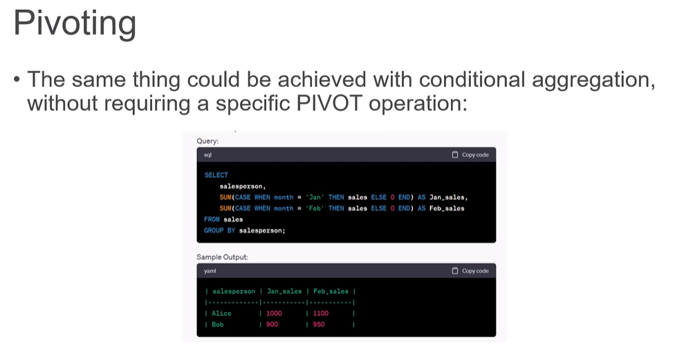
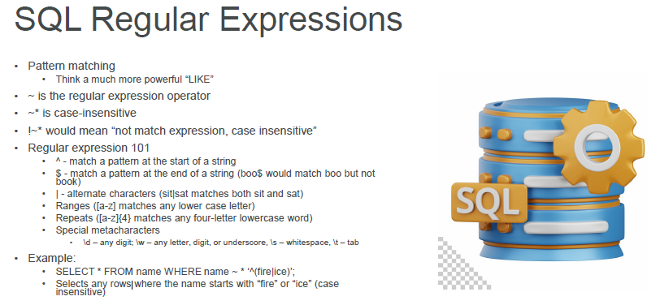

## THis page is for adding the DE Notes here.

1 Schema :
    - Data warehousing: Schema on write(pre-defined schema before writing data)
        - Extract transform Load (**ETL**)
    - Data Lake: Schema on read (Schema is defined at the time of reading data)
        - Extract load transform(ELT)
2. Data Lake bring s more flexibility like structured ans unstructured data.
   - More flexibility and BI stuff and loaded into DB.
3. JDBC vs ODBC
   - in JDBC Java Database connectivity
     - platform independent , can run on any platform
     - but language dependent
   - in ODBC Open database connectivity
     - platform dependent(thr Driver)
     - Language independent
4. AVro :- Binary format that stores both the data and its schema, allowing it to be processed later
5. Parque :- store data in a columnar format instead of rows.
   - used more in data Analytics engine
   - storing data in distributed system I/O.
6. RDD :- Resilient Distributed dataset(RDD) refer to the ability of RDD to automatically recover from failure and fault-tolerant. 
7. data sampling in two type 
   - Random sampling 
   - Stratified sampling
     - divide population into homogenous subgroups.
8. Data Skew :- means unequal distribution or imbalance of data across various nodes or partitioned in distribution computing.
   - using where clause we can have only one filter , what about if we want to have to apply more then one filter the how to do SO ? 
        SELECT COUNT(*) AS high_salary_count
        FROM employee 
        WHERE salary > 70000;
   - One way to  apply multiple filters to what you are aggregating 
        SELECT
               COUNT(CASE WHEN salary >70000 then 1 END) as high_salary_count,
               COUNT(CASE WHEN salary BETWEEN 50000 AND 70000 THEN 1 END) as medium_salary_count,
               COUNT(CASE WHEN salary <50000 THEN 1 END) as low_salary_count
        FROM employee
9. Pivoting
   - 

## SQL
10. Joins
    - Inner join
    - Left outer Join
    - Right outer Join
    - Full Outer Join 
    - cross outer join - provide every combination of table A and B
11. SQL Regular Expression
    - 
12. Git Remote repositories
    - git remote add <name> <url>: Add a remote repository.
    - git remote: List all remote repositories.
    - git push <remote> <branch>: Push a branch to a remote repository.
    - git pull <remote> <branch>: Pull changes from a remote repository branch into the current local branch.
    - git reset: Reset your staging area to match the most recent commit, without affecting the working directory.
    - git reset --hard: Reset the staging area and the working directory to match the most recent commit.
    - git revert <commit>: Create a new commit that undoes all of the changes from a previous commit.
    - git stash: Temporarily save changes that are not yet ready for a commit.
    - git stash pop: Restore the most recently stashed changes.
    - git rebase <branch>: Reapply changes from one branch onto another, often used to integrate changes from one branch into another.
    - git cherry-pick <commit>: Apply changes from a specific commit to the current branch.
    - git blame <file>: Show who made changes to a file and when.
    - git diff: Show changes between commits, commit and working tree, etc.
    - git fetch: Fetch changes from a remote repository without merging them.
    - git fsck: Check the database for errors.
    - git gc: Clean up and optimize the local repository.
    - git reflog: Record when refs were updated in the local repository, useful for recovering lost commits.
13. Amazon S3:- must not start  with prefix xn-- , -s3alias
    - Object values are the content of the body:
      - Max. Object Size is 5TB (5000GB)
      - If uploading more than 5GB, must use “multi-part upload”
14. 