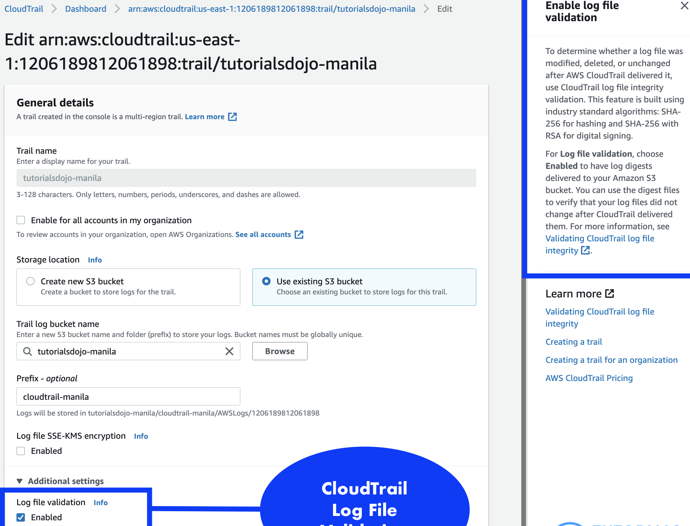

  
- i am policy to ensure encrypted EBS volume can be created is :

	
    {
        "Sid" : "Name001",
        "Effect" : "Allow",
        "Action" : [
            "ec2: createdVolume"
        ],
        "Condition":{
            "Bool": {
                "ec2: encrypted" : "true"
            }
        },
        "Resource": [
            "*"
        ]
    }

- in Convertible Reserved Instances, you are allowed to exchange another Convertible Reserved instance with a different instance type and tenancy.

- **Amazon FSx for Lustre** is an ideal solution for the **animation studio’s** requirements. 
  - FSx for Lustre provides a fully managed, high-performance, scalable storage service, specifically designed for **compute-intensive workloads like 3D** animation rendering.
  - It offers shared storage with sub-millisecond latencies and can deliver up to terabytes per second of throughput, crucial for handling **hundreds of gigabytes** of data daily as in the studio’s case.
- **FSx for Lustre scratch file systems** are optimized for high-performance computing applications and provide high throughput and low latency, 
  - they are designed for temporary storage and are not intended for long-term persistence.
- if customer have AWS CloudTrail enabled for logging purposes , then we can **Query with AWS CloudTrail Lake to find specific errors** in CloudTrail logs.

- "a serverless architecture that allows AWS Lambda to access an Amazon DynamoDB table named tutorialsdojo in the US East (N. Virginia) region. The IAM policy attached to a Lambda function allows it to put and delete items in the table. The policy must be updated to only allow two operations in the tutorialsdojo table and prevent other DynamoDB tables from being modified."

    {
        "Version" : "2012-10-17",
	"Statement": [
		{
			"Sid": "tutorialDojo",
			"Effert": "Allow",
			"Action" :[
					"dynamodb:PutItem",
					"dynamodb:DeleteItem"
			],
			"Resource": "arn:aws:dynamodb:us-east-1:1206181206:table/tutorialDojo"
		}
	  ]
    }
- "A serverless application has been launched on the DevOps team’s AWS account. Users from the development team’s account must be granted permission to invoke the Lambda function that runs the application."

  
    {
      "Version" : "2012-10-17",
      "Id":"default",
      "Statement": [
          {
              "Sid": "tutorialDojo-lambda-allow-s3-my-function",
              "Effert": "Allow",
              "Principal":{
                  "Service": "s3.amazonaws.com"
              },
              "Action" :"lambda.invokeFunction",
              "Resource": "arn:aws:dynamodb:us-east-1:1206181206:table/tutorialDojo",
              "Condition": {
                  "StringEquals":{
                      "AWS:SourceAccount": "12345678"
                  },
                  "ArnLike":{
                      "AWS:sourceArn": "arn:aws:s3:::tutorialDojo-lambda-allow-s3-my-function"
                  }
              }
          }
      ]
  }
  

- To determine whether a log file was modified, deleted, or unchanged after CloudTrail delivered it, you can use CloudTrail log file integrity validation. 
- This feature is built using industry-standard algorithms: SHA-256 for hashing and SHA-256 with RSA for digital signing.
  - 

    - "The DevOps Team at Agila Corporation aims to enforce an IAM policy that grants them exclusive permissions to start, stop, and terminate EC2 instances in the us-west-1 region. To maintain strict security measures, any requests originating outside the company’s network range (192.158.1.0/24) should be denied."

      {
          "Version": "2012-10-17",
          "Statement": [
              {
                  "Effect": "Allow",
                  "Action": [
                      "ec2:TerminateInstances",
                      "ec2:StartInstances",
                      "ec2:StopInstances"
                  ],
  
                  "Resource": "*",
                  "Condition": {
                      "StringEquals": {
                          "aws:RequestedRegion": "us-west-1"
                      }
                  }
              },
              {
                  "Effect": "Deny",
                  "Action": "ec2:*",
                  "Resource": "*",
                  "Condition": {
                      "NotIpAddress": {
                          "aws:SourceIp": "192.158.1.0/24"
                      }
                  }
              }
          ]
      }

- AAAA ? Load Balancer ?
**AWS Glue Job bookMarks**  - help AWS Glue maintain state information and prevent the reprocessing of old data.

- 