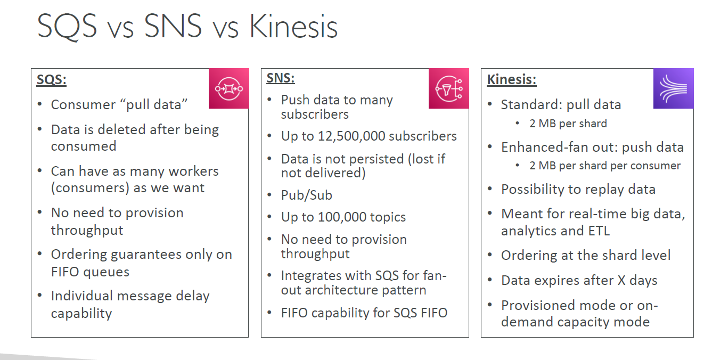

# AWS-Solutions-Architect-Associate

it has vary specific notes on the use cases of AWS components and helps in understanding each of them with short
description

1. **DataBase**
    - **Amazon Neptune**
        - Amazon Neptune is a fast, reliable, fully managed **graph database** service that makes it easy to build and
          run applications that work with highly connected datasets.

    - **Amazon Aurora**
        - Amazon Aurora is a **MySQL and PostgreSQL-compatible relational database** built for the cloud, that combines
          the performance and availability of **traditional enterprise databases with the simplicity** and
          cost-effectiveness of open source databases. Amazon Aurora features a distributed, fault-tolerant,
          self-healing storage system that **auto-scales up to 64TB per database instance**.

    - **DynamoDB** :- it is a noSQL DB, unstructured DB. have two types as Provision Mode and On Demand Mode ,
        - **Provisioned Mode** - pay for Provisioned Read Capacity Units(RCU) and Write Capacity Units(WCU) , and costly
        - **in On-Demand Mode** - read/writes automatically scale up/down with your work load.
        - **DynamoDB Accelerator (DAX)** is a fully managed, highly available, **in-memory cache** for DynamoDB that
          delivers up to 10x performance improvement. It caches the most frequently used data, thus offloading the heavy
          reads on hot keys off your DynamoDB table, hence preventing the "ProvisionedThroughputExceededException"
          exception.
        - **DynamoDB Streams** allows you to capture a **time-ordered sequence of item-level modifications** in a DynamoDB
          table. It's integrated with AWS Lambda so that you create triggers that automatically respond to events in
          real-time.
          - commonly used for replication or table audits.
          - The primary restrictions imposed by DynamoDB Streams are:
            - only 1 or 2 consumers (you need to use fanout patterns beyond that)
            - only 24h retention. While absolutely all changes are recorded, and in strict order, there is a hard limit on the retention ,you need to grab them and do something, quick.
   
    - **RDS** - Amazon Relational Database Service (Amazon RDS) makes it **easy to set up, operate, and scale a relational
      database in the cloud.**
        - It provides cost-efficient and resizable capacity while automating time-consuming administration tasks such as
          hardware provisioning, database setup, patching, and backups.
        - mainly used for **On-Line Transaction Processing (OLTP)** applications and not for Online Analytics Processing (OLAP)

    - **ElastiCache** - Amazon ElastiCache allows you to seamlessly set up, run, and scale popular open-Source
      compatible in-memory data stores in the cloud. Build data-intensive apps or boost the performance of your existing
      databases by retrieving data from high throughput and low latency in-memory data stores.
        - Amazon ElastiCache is a popular choice for real-time use cases like Caching, Session Stores, Gaming,
          Geospatial Services, Real-Time Analytics, and Queuing.
    - **Amazon Quantum Ledger Database (Amazon QLDB)** - is a fully managed ledger database that provides a transparent, immutable, and **cryptographically verifiable transaction log** owned by a central trusted authority. 
      - Amazon QLDB can be used to **track every application data change and maintains a complete and verifiable history** of changes over time.
   
    - **Amazon Redshift**
        - Amazon Redshift is a **fully-managed petabyte-scale cloud-based data warehouse product** designed for large
          scale data set storage and analysis.
            - **Amazon Redshift Spectrum**, you can efficiently **query and retrieve structured and semi structured data
              from files in Amazon S3 without having to load the data into Amazon Redshift tables**
            
2. **AWS Transit Gateway**
    - All VPCs link to a single, central hub, making it much simpler to manage and track
    - Create a route table for the transit gateway and add a route that allows traffic between VPC A and VPC B's CIDR
      blocks. Associate this route table with VPC A and VPC B attachments.
    - if we have 5 VPC then we can use **transit gateway** to interconnect the VPC
3. **AWS Global Accelerator**
   1. What is the difference between CloudFront and Global Accelerator?
      1. CloudFront uses Edge Locations to cache content while Global Accelerator uses Edge Locations to find an optimal pathway to the nearest regional endpoint. CloudFront is designed to handle HTTP protocol meanwhile Global Accelerator is best used for both HTTP and non-HTTP protocols such as TCP and UDP. 
      2. ex :- You are designing the architecture for a global **SaaS application** that will be deployed in the AWS cloud across
            multiple regions. The application needs to provide fast, reliable access for users across the globe. You want to
            improve performance and availability for users **by routing traffic through the AWS global network**.
4. **Cross-region replication**
    - copies objects between S3 buckets in different regions
5. 
    - **CloudFront**
    -  Enable accelerated, reliable and secure content delivery for Amazon S3 buckets, Application Load Balancers, Amazon API Gateway APIs, and more in 5 minutes or less. used for caching content at the edge
6. PrivateLink - a private network connection between VPCs and AWS services. 
7. Direct Connect -  is a dedicated, private connection between on-premises infrastructure and an AWS Location.
8. **Amazon Direct Connect**:
- Move GB/s of data to the cloud, over a private secure network - from its on-premises data center to AWS

9. **Amazon Snowball**
    - migrate 50 **Terabytes** of data from on-premises data centers to Amazon S3.
    - AWS Snowball is available in two device types.
        - **Snowball Edge Compute Optimized** - with more computing capabilities, suited for higher performance
          workloads
        - **Snowball Edge - Storage Optimized** with more storage, which is suited for large-scale data migrations and
          capacity-oriented workloads.
10. **AMAZON Snowmobile**
     - To migrate large datasets of 10 Petabyte or more in a single location
     - Ship the - data to AWS using Snowmobile to transfer the data offline.

     - How should I choose between Snowmobile and Snowball? To migrate large datasets of 10 **Petabyte** or more in a
       single location, you should use Snowmobile.
     - For datasets less than 10 **Petabyte** or distributed in multiple locations, you should use Snowball.

11. **AWS Snowcone**
     - is a portable, rugged, and secure device for edge computing and data transfer. You can use a Snowcone device to
       collect, process, and move data to the AWS Cloud, either offline by shipping the device to AWS, or online by using
       **AWS DataSync**.
12. **AWS AppSync** enables developers to connect their applications and services to data and events with secure, serverless and 
    - with **GraphQL APIs** built with AWS AppSync give frontend developers the ability to query multiple databases, microservices, and APIs from a single GraphQL endpoint. 
    - with **Pub/Sub APIs** built with AWS AppSync give frontend developers the ability to publish real-time data updates to subscribed API clients through serverless WebSocket connections.
13. **Amazon DataSync**
     - Move large amount of data between **on-premises and S3**, EFS, FSx for Windows and **aws to aws**.
     - migrate 10 TB of data from an on-premises NAS device to Amazon S3. The data transfer needs to start - immediately
       and complete within 12 hours. Your on-premises network has a 1 Gbps connection to AWS.

14. **Transfer Acceleration**
    - a media company that frequently transfers large video files between an on-premises data center and Amazon S3. The
      company would like to accelerate these transfers to improve efficiency.
    - uses the AWS global network, **cloud front** and edge locations to accelerate uploads to and downloads from an S3 bucket over long
      distances. This would help accelerate transfers between the on-premises data center and S3
15. **Virtual private gateway**.
    - Explanation: A virtual private gateway enables communication between a **VPC and an on-premises network over an
      IPsec VPN tunnel**. It supports overlapping IP address ranges and meets the requirements stated in the scenario.
16. **NAT gateway**
    - Instances in the private subnet can access the internet by using a NAT gateway.
    - The NAT gateway will perform source **NAT and translate the private IP** to a public IP when traffic goes to the
      internet

17. **Internet gateway**
    - Attaching an internet gateway to the VPC allows resources in the VPC such as instances in private subnets to
      connect to the internet by routing their traffic through a NAT gateway. This allows private resources internet
      access while keeping them private.

18. **VPC peering**
    - requirement : You have two VPCs, VPC A (10.0.0.0/16) in us-east-1 and VPC B (10.1.0.0/16) in us-west-2. You need
      to allow resources in VPC A to communicate with resources in VPC B.
    - VPC peering allows resources in two VPCs, even in different regions, to communicate with each other as if they are
      within the same network. A VPC peering connection needs to be created between the VPCs and routes configured to
      route traffic between them. This allows resources in VPC A to communicate with resources in VPC B.
19. **SQS**
    - The messages need to be processed asynchronously and out of order. Your application needs to **ensure no messages
      are lost.**
    - Amazon SQS provides a message queue service that enables asynchronous message processing. It supports out-of-order
      processing and ensures no messages are lost.
    - by default a msg visibility time 30 seconds, once it pooled by consumer.
    - if consumer has not pooled and deleted the msg from the SQS queue then the msg will be visible after 30 seconds.
    - a consumer could call the ChangeMessageVisibility API to get more time.
    - if visibility timeout is high and consumer crashes, then reprocessing will take place.
    - -SQS -standard Queue.
        - in this Duplicate entry on the queue is allowed
    - SQS -FIFO Queue.
        - in this kind of Queue we can keep orders of the msg send to the queue.
        - limited throughput: 300 msg/s without batching, 3000 msg/s with.
        - Exactly once send capability.(by removing duplicates).
        - Messages are processed in order by the consumer.
    - SQS - long pooling:
        - when a consumer request message from the queue it can optionally wait for the msg to arrive if there are none
          in the queue.
        - Long pooling decreases number of API calls while increasing the efficiency and latency of your application,
          the wait time can be 1 to 20 second. (preferable 20 second). long pooling can be enabled at queue level or at
          the API level using WaitTimeSeconds.

20. **SNS**
    - SNS is designed for fan out messaging and can deliver messages concurrently to a large number of subscribers
      including Lambda functions. This makes it an effective choice for fan out to improve event throughput.
    - Push once in SNS , receive in all SQS queues that are subscribed.Fully decoupled , no data loss.
    - allows sending push notifications but **does not have built-in analytics for tracking app usage** or targeting
      user segments.

21. **Amazon Pinpoint**
    - send **push notifications and has features for tracking app usage**, defining user segments, and sending targeted
      campaigns.
    - Pinpoint is designed for sending push notifications to mobile apps too.
    - Scales to Billions of messages per day.

22. **Kinesis**

    - it makes it easy to collect, process and analyze streaming data in real time.
    - ingest real time data as Application log, Metrics, Website **clickstream**.
    - Kinesis is of 4 types.
        - Kinesis Data Firehose. - load data stream into AWS data stores.
          - is the easiest way to load streaming data into data stores and analytics tools. 
          - It can capture, transform, and load streaming data into Amazon S3, Amazon Redshift, Amazon OpenSearch Service, and Splunk.
          - Enabling near real-time analytics with existing business intelligence tools and dashboards
        - Kinesis Data Analytics. - analyze data stream with SQL or Apache Flink.
        - Kinesis Data stream. - capture, process, store data streams.
        - Kinesis video Streams. - capture process store data stream.

23. **ECS** (Elastic container service)
    - The application consists of a front-end container that communicates with a back-end container. The containers need
      to scale automatically based on demand. You want to deploy the containers on ECS and manage them as a single
      application.
    - The most efficient approach is to use a single ECS service with one task definition running both containers. This
      allows managing them together while still providing auto scaling based on demand.
24. **ECR** (Elastic container Registry)
    - Private Repository.
    - ECR Used to Store and manage Docker image on AWS.
    - Your company is migrating its monolithic application to microservices hosted in containers. The development team
      wants to use ECR to store and manage the container images. The images must be accessible to applications running
      in a VPC with private subnets only.
    - An ECR repository can be configured with a VPC endpoint policy to allow access only from the specified VPC and
      subnets. This meets the requirement to restrict access to the VPC with private subnets only.

25. **EKS** (Elastic Kubernates Service)
    - You are designing a Kubernetes environment on AWS that will run a variety of microservices applications. The
      applications have unpredictable traffic patterns and can scale up rapidly at times. You want to optimize cost
      efficiency while still providing high availability.
    - Deploy Amazon EKS with a mix of spot and on-demand instances in multiple Availability Zones.

26. **Amazon Fargate**
    - The application consists of a front-end and a back-end container. The front-end needs to scale automatically based
      on demand. The back-end needs to run consistently with no interruptions. You want to optimize cost.
    - Deploy both containers to a **Fargate service configured with a load balancer and auto scaling** to optimize cost.
27. **Amazon CloudFront**
    - it supports JavaScript, can handle million of request per second, max execution time <1 millisecond
    - Max Memory 2 MB , total PKG size 10 KB, free tier available 1/6th price of @Edge.

28. **Lambda@Edge**

    - it supports node.js , python , can handle 1000 of requests , triggers Viewer Request/Response and Origin
      Request/Response.
    - max execution time 5 -10 seconds , max memory 128 MB - 10 GB , total package size = 1 MB -50 MB.
29. **Amazon Lambda**

    - Execution:
        - Memory allocation: 128 MB – 10GB (1 MB increments)
        - Maximum execution time: 900 seconds (15 minutes)
        - Environment variables (4 KB)
        - Disk capacity in the “function container” (in /tmp): 512 MB to 10GB.
        - Concurrency executions: 1000 (can be increased).
    - Deployment:
        - Lambda function deployment size (compressed .zip): 50 MB
        - Size of uncompressed deployment (code + dependencies): 250 MB
        - Can use the /tmp directory to load other files at startup.
        - Size of environment variables: 4 KB.

30. **CloudWatch**
    - **monitor** everything like (applications, infrastructure, network, and services)and use **alarms, logs,** and events data to take automated actions and reduce mean time to resolution (MTTR).
    - but **not API calls** .
    - CloudWatch **Logs agent** provides an automated way to send log data to CloudWatch Logs

31. **CloudTrail**
    - it provides governance ,audit and compliance for AWS account.
    - inaccurate resource provisioning
    - hitting service limits
    - Bursts of AWS IAM actions
    - Gaps in periodic maintenance activity
    - The security team has requested that **all API calls** made within your AWS account be logged for auditing and
      troubleshooting purposes.
    - Enable AWS CloudTrail trail logging across all regions and turn on log file validation.
    - example **S3 buckets settings being changed regularly by some one**. 
      - The CloudTrail Processing Library is a Java library that provides an easy way to process AWS CloudTrail logs. You provide configuration details about your CloudTrail SQS queue and write code to process events. The CloudTrail Processing Library does the rest.
32. **Amazon EventBridge**
    - EventBridge allows responding to events from various AWS services as well as custom applications. It meets the
      requirements of decoupled architecture, **responding to events**, and supporting AWS and custom sources.
    - Receives Notification when specific **Amazon S3 events such as Object creation or deletion occur in the S3** Bucket.
33. **Amazon AppFlow**
    - is a fully managed integration service that helps you securely **transfer data** between **software as a service** (SaaS)
      applications such as Salesforce, SAP, Google Analytics, Facebook Ads, and ServiceNow, and AWS services such as
      Amazon Simple Storage Service (S3) and Amazon Redshift in just a few clicks.

34. **AWS Control Tower**
    - The AWS Control Tower dashboard gives you continuous visibility into your AWS environment. You can view the number
      of **OUs and accounts provisioned**
    - is used by cloud administrators and architects to **set up and govern a secure, multi-account**
    - for a large enterprise that wants to set up a **multi-account environment in AWS** using AWS Control Tower.
    - is used to simplify the creation of new accounts with preconfigured constraints.

35. ###**Security, Identity, & Compliance** :
    - **AWS Artifact** - **On-demand access to AWS compliance reports**
    - **AWS Audit Manager**  - Audit your AWS usage to simplify how you **assess risk and compliance**
    - **AWS Cloud Directory** - Store hundreds of millions of application-specific objects.
    - **AWS Cognito** - Identity management for your apps.
    - **AWS Detective** - Investigate potential security issues.
    - **AWS Directory Service** - Set up and run Microsoft Active Directory with AWS services
    - **AWS Firewall Manager** - Deploy network security across your VPCs with just a few clicks
    - **AWS GovCloud** (US) Move sensitive workloads into the cloud.
    - **AWS Identity and Access Management** - Securely manage access to services and resources
    - **AWS IAM Identity Center** - Manage single sign-on access to AWS accounts and apps.
    - **AWS Network Firewall** - Deploy network security across your Amazon VPCs to protect VPC against potential threats.
    - **AWS Payment Cryptography** - Fully managed payment cryptography service.
    - **AWS Resource Access Manager** - Simple, secure service to share AWS resources.
    - **AWS Secrets Manager** - **Rotate, manage, and retrieve secrets**.
    - **AWS Security Documentation** - Security documentation by category.
    - **AWS Security Hub** - **Unified security and compliance center**.
    - **AWS Security Lake** - Automatically centralize your security data with a few clicks
    - **AWS WorkSpaces** enables you to provision virtual, cloud-based Microsoft Windows, Amazon Linux, or Ubuntu Linux desktops for your users, known as WorkSpaces. 
      - WorkSpaces eliminates the need to procure and deploy hardware or install complex software.
    - **AWS Shield** - **DDoS protection**.
    - **AWS WAF** - Filter **malicious web traffic**.
      - A rate-based rule tracks the rate of requests for each originating IP address and triggers the rule action on IPs with rates that go over a limit. You set the limit as the number of requests per 5-minute time span. You can use this type of rule to put a temporary block on requests from an IP address that’s sending excessive requests.
      - XSS and SQL Injection are both app level attack hence needs a WAF.
    - **AWS Athena** is an interactive query service that makes it easy to analyze data in **Amazon S3 using standard SQL** expressions. Athena is serverless, so there is no infrastructure to manage.
    - **AWS Redshift** also includes Redshift Spectrum, allowing you to directly run **SQL queries against exabytes of unstructured data**** in Amazon S3**. 
      - Is designed primarily for Online Analytical Processing (OLAP) workloads 
      - No loading or transformation is required, and you can use open data formats, including Avro, CSV, Grok, ORC, Parquet, RCFile, RegexSerDe, SequenceFile, TextFile, and TSV. 
        - **Redshift Spectrum** automatically scales query compute capacity
    - **AWS Glue DataBrew** :- is a visual data preparation tool that enables users to clean and normalize data without writing any code. 
        - Using DataBrew helps reduce the time it takes to prepare data for analytics and machine learning (ML) by up to 80 percent, compared to custom developed data preparation. 
        - You can choose from over 250 ready-made transformations to automate data preparation tasks, such as filtering anomalies, converting data to standard formats, and correcting invalid values.
    - **AWS MWAA** :- Amazon managed workflow for Apache Airflow. that can be used for data pipeline in the cloud. 
        - and Apache airflow is a open-source tool used for programmatically author and schedule and monitor sequence.
        - 

36. **Others**.

    - **AWS Lex**: build conversational bots – chatbots
    - **AWS Connect**: cloud contact center
    - **AWS Comprehend** : natural language processing (NLP) to find **meaning and insights in text**.
    - **AWS Comprehend Medical** - This service is specifically built for natural language processing for medical
      text. It can identify medication names, dosages, symptoms etc. from unstructured clinical text.
    - **AWS App Mesh** it easy to run services by providing consistent visibility and network traffic controls for every service. 
    - **AWS SageMaker** - Fully managed service for developer, data scientist for Build ML model.
    - **AWS Forecast** - use ML to deliver accurate forcast.
    - **AWS Kendra** - fully managed document search service, extract answer from document , it read files ,PDF from
      google Drive and s3.
    - **AWS Personalize** - fully managed ML , to build apps with real time personalized recommendation. , also send sms
      and email ,
    - **AWS textract** - **help to extract text** , analyze and data will be given .
    - **AWS Translate**: provides real-time, high-quality, and affordable language translation
    - **AWS Rekognition** : **face detection**, labeling, **celebrity recognition** , **remove pornographic content** ,inappropriate content, including explicit or suggestive adult content, violent content, and offensive language.
    - **AWS Transcribe** : **audio to text (ex: subtitles)** , **remove any Personally Identifiable Information** (PII) from
   the call before it's saved.
    
    - **AWS Polly**: **text to audio** , Pronunciation Lexicon, Speech synthesis Markup language (SSML)
    - **AWS Config** : Detailed view of the configuration of AWS resources in your AWS account. 
      - This includes how the resources are related to one another and how they were configured in the past so that you can see how the **configurations and relationships change over time**.
    - **AWS GuardDuty** : 
    - is a threat detection service that **continuously monitors your AWS workloads for malicious activity**. 
    - uses ML to create intelligent Threat discovery to protect your AWS Account,anomaly
   detection, 3rd party data, One click to enable (30 days trial), no need to install software.
    - GuardDuty analyzes tens of billions of events across multiple AWS data sources, such as 
      - AWS CloudTrail events, 
      - Amazon VPC Flow Logs, 
      - and DNS logs.
    - **AWS Inspector**
    - Automated Security Assessments and easy Reporting & integration with AWS Security Hub
    - **Sends findings to Amazon Event Bridge.**
    - Continuous **scanning of the infrastructure**.
    - Automated and continual **vulnerability management at scale**.
    - **AWS Macie**
    - Amazon Macie is a fully managed data security and data privacy service that uses **machine learning and pattern
      matching to discover and protect your sensitive data** in AWS.
    - Discover and protect your sensitive data at scale.
    - Macie helps **identify and alert you to sensitive data, ex: as personally identifiable information (PII)**.
    - **AWS Elastic Transcoder** :
    - allows you to easily **convert media files stored in Amazon S3 into multiple formats**.
    - It provides transcoding optimizations like resolution and bitrate adjustment to support playback on different
      devices.
    - Fully managed and secure pay for what you use.
    - **AWS Trusted Advisor** that provides you with **real-time guidance to help you provision your resources** following AWS best practices. 
    - It inspects your AWS environment and makes recommendations for saving money, improving system performance and reliability, or closing security gaps. 
    - however, it **can’t scan for software vulnerabilities** inside Amazon EC2 instances.
    - **AWS Proton** is a **deployment workflow tool for modern applications**. It can be used to manage Infrastructure as Code (IaC) templates build using tools like CloudFormation or Terraform.
37. **AWS Keyspaces (for Apache Cassandra)** is a scalable, highly available, and managed **Apache Cassandra–compatible database** service. With Amazon Keyspaces, you can run your Cassandra workloads on AWS using the same Cassandra application code
38. **AWS Compute Optimizer** recommends optimal AWS resources for your workloads to reduce costs and improve performance by using machine learning to analyze historical utilization metrics. 
    1. Overprovisioning resources can lead to unnecessary infrastructure costs, and underprovisioning resources can lead to poor application performance.

39. **Other Definations**
    - EBS volumes: Network storage for one EC2 instance at a time
    - Instance Storage: Physical storage for your EC2 instance (high IOPS)
    - EFS: Network File System for Linux instances, POSIX filesystem
    - FSx for Windows: Network File System for Windows servers
    - FSx for Lustre: High Performance Computing Linux file system
    - FSx for NetApp ONTAP: High OS Compatibility
    - FSx for OpenZFS: Managed ZFS file system

40. **Classic Ports to know**
    - 22 = SSH (Secure Shell) - log into a Linux instance
    - 21 = FTP (File Transfer Protocol) – upload files into a file share
    - 22 = SFTP (Secure File Transfer Protocol) – upload files using SSH
    - 80 = HTTP – access unsecured websites
    - 443 = HTTPS – access secured websites
    - 3389 = RDP (Remote Desktop Protocol) – log into a Windows instance
    - The **/32** denotes one IP address and the **/0** refers to the entire network.
    - Use **Signed Cookies to control who can access the private files** in your CloudFront distribution by modifying your application to determine whether a user should have access to your content.
      - For members, send the required Set-Cookie headers to the viewer which will unlock the content only to them.
      
41. **Overall, try to avoid using Elastic IP**:
    - They often reflect poor architectural decisions, Instead, use a random public IP and register a DNS name to it
    - Or, as we’ll see later, use a Load Balancer and don’t use a public IP.

42. **SQS VS SNS VS Kinsesis**

    

43. **Notes**
    - S3 Transfer Acceleration helps speed up **long-distance object transfers between S3 buckets**, while Global
      Accelerator helps manage **traffic across multiple AWS regions**.
    - Glacier is a storage service, used for archival storage. Snowball is data transfer service, used for transferring
      data from your data center or any other source to AWS.
    - Breaking a large object upload into smaller pieces has a number of advantages. It can improve throughput by
      uploading a number of parts in parallel. It can also recover from a network error more quickly by only restarting
      the upload for the failed parts.
    - You can't move data directly from Snowball into Glacier, you need to go through S3 first, and then use a lifecycle
      policy.
    - **CloudFront uses Edge Locations to cache content while Global Accelerator uses Edge Locations to find an optimal
      pathway to the nearest regional** endpoint. 
    - S3 batch replication to copy objects across S3 buckets in different Regions using S3 console
    - The Lambda Function must be deployed in your VPC, because RDS Proxy is never publicly accessible.
    - AWS Backup - Automatically back up your filesystem.
    - AWS Lambda - Run code without thinking about servers. Pay only for the compute time you consume.
    - AWS Transfer - Seamlessly transfer files over SFTP, FTPS, and FTP protocols into your filesystem
    - Amazon Elastic- File Storage) provides a simple, scalable, fully managed elastic NFS file system for use with AWS Cloud services and on-premises resources. 
      - It is built to scale on demand to petabytes without disrupting applications, growing and shrinking automatically as you add and remove files, eliminating the need to provision and manage capacity to accommodate growth.
    - AWS DataSync - Automate data transfers between on-premises storage and your file system ex: S3.
      - Secure and Most reliable transfer then use = **AWS DataSync over AWS Direct Connect** for sensitive data.
    - frequently accessed data in Amazon S3 can be stored from the other treading system. and Use Amazon **S3 Select** to run the queries.
    - Create an IAM role for each use case. Assign appropriate permissions to the role for each use case. Associate the role with Athena.
      
### Links for more info

1. Architecting for the cloud:  https://d1.awsstatic.com/whitepapers/AWS_Cloud_Best_Practices.pdf (Archived)
2. Whitepapers related to well-architected framework are mentioned
   here:  https://aws.amazon.com/blogs/aws/aws-well-architected-framework-updated-white-papers-tools-and-best-practices/
3. Disaster recovery whitepaper:  https://d1.awsstatic.com/whitepapers/aws-disaster-recovery.pdf (Archived)
4. AWS now recommends a well-architected framework
   whitepaper:  https://d1.awsstatic.com/whitepapers/architecture/AWS_Well-Architected_Framework.pdf
 